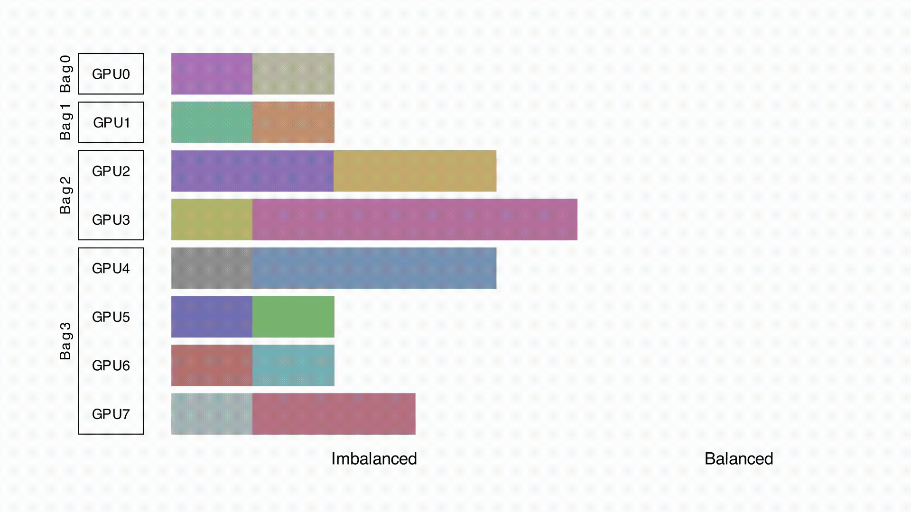

# KnapFormer

KnapFormer: An Online Load Balancer for Efficient Diffusion Transformers Training

[Kai Zhang](https://www.linkedin.com/in/kai-zhang-53910214a/), [Peng Wang](https://www.linkedin.com/in/peng-wang-1b569b334/), [Sai Bi](https://www.linkedin.com/in/saibifig/), [Jianming Zhang](https://www.linkedin.com/in/jianming-zhang-60762227/), [Yuanjun Xiong](https://www.linkedin.com/in/yjxiong/)

[PDF Tech Report](assets/paper.pdf)

## Description

KnapFormer is a project focused on online load balancing for Diffusion Transformer (DiT) training. It's particularly suited for the case where the data sources are highly heterogeneous, including images/keyframes/videos from low-res to high-res and from low-fps to high-fps. 

See below for an animation how we logically group GPUs into compute bags spanning one or more GPUs and re-route sequence (chunks) to achieve balanced computation across GPUs.



## Installation
```bash
# Install uv
curl -LsSf https://astral.sh/uv/install.sh | sh

# Install KnapFormer and dependencies
uv sync
# To save plotly figure
uv run plotly_get_chrome -y

# For development, also do
uv run pre-commit install

# To activate uv env
source ./.venv/bin/activate
```

## Project Structure

- `knapformer/` - Main package code
- `simulator/` - Simulation components
- `utils/` - Utility functions
- `tests/` - Test suite
- `scripts/` - Execution scripts


## Usage

### Workload Estimator

The workload estimator benchmarks and estimates the computational workload of DiT models. It supports both standard Transformer and Flux (MMDiT) architectures.

```bash
python knapformer/workload_estimator.py [output_file] \
    [--d_model d_model] [--d_head d_head] [--causal causal] \
    [--use_flux use_flux] [--n_ds_layers n_ds_layers] [--n_ss_layers n_ss_layers]
```

The script will benchmark the workload and generate plots showing theoretical vs. actual workload estimates. If an output file is provided, install the plotly chrome extension using `plotly_get_chrome` before running.

### Integrating KnapFormer with MMDiT

KnapFormer provides seamless integration with MMDiT architectures for dynamic load balancing. The integration is designed to be as minimally intrusive as possible. You can reference the provided example to integrate KnapFormer into your own DiT. 

**Key Integration Points:**
- **MMDiT Forward Pass**: See [`simulator/simulator_model.py`](simulator/simulator_model.py) (lines 75-146) for routing and reverse routing implementation
- **Attention Integration**: See [`utils/transformer_utils.py`](utils/transformer_utils.py) (lines 396-429) for pre/post attention operations
- **Double Stream Blocks**: See [`utils/mmdit_utils.py`](utils/mmdit_utils.py) (lines 207-321) for text/image token processing with balancing; (lines 308-319) for FSDP-compatible conditional execution

### Training Simulator

KnapFormer includes a comprehensive training simulator for benchmarking load balancing performance across different configurations.

**Key Features:**
- **Multi-architecture Support**: Simulates both standard Transformer and Flux (MMDiT) models
- **Distributed Training**: Full support for multi-node, multi-GPU setups with FSDP
- **Performance Metrics**: Measures forward+backward latency, total throughput, HFU (Hardware Flop Utilization), and load imbalance ratios
- **Comparative Analysis**: Runs experiments with and without sequence balancing for direct comparison

**Usage:**
```bash
# Run simulator with sequence balancer
torchrun --nproc_per_node=8 simulator/simulate.py \
    --data_codes "g8b32i256f1s0" --balancer_config "g1n8" \
    --gamma 0.4 --d_model 3072 --use_flux 0

# See simulator/simulate.py for full parameter list
```

**Implementation Details:**
- **Main Simulator**: [`simulator/simulate.py`](simulator/simulate.py) - Core simulation logic and performance measurement
- **Model Definitions**: [`simulator/simulator_model.py`](simulator/simulator_model.py) - Transformer and MMDiT model implementations
- **Data Generation**: [`simulator/simulator_data.py`](simulator/simulator_data.py) - Synthetic data generation with configurable sequence lengths

### Experiment Launcher

One-click batch experiment runner that automates comprehensive performance evaluations across multiple configurations.

**Features:**
- **Automated Experiments**: Pre-configured experiment sets for Flux models with various balancing strategies
- **Result Aggregation**: Automatic log parsing and performance comparison generation
- **Multi-node Support**: Handles distributed experiment execution with proper synchronization
- **Comprehensive Reporting**: Generates detailed summaries with throughput improvements and configuration comparisons

**Usage:**
```bash
# Run default experiment
python scripts/experiment_launcher.py --experiment-type default

# Run all Flux experiments (multiple balancer configurations)
# This requires at least 32 GPUS to run - otherwise you need to change the balancer_config
python scripts/experiment_launcher.py --experiment-type flux

# Custom experiment
python scripts/experiment_launcher.py --experiment-type custom \
    --name "my_experiment" --data-codes "g8b32i256f1s0" --balancer-config "g2n16"

# Dry run (generate scripts without execution)
python scripts/experiment_launcher.py --experiment-type flux --dry-run
```

**Implementation:**
- **Launcher**: [`scripts/experiment_launcher.py`](scripts/experiment_launcher.py) - Python-based experiment orchestration with result aggregation
- **Template**: [`scripts/experiment_template.sh`](scripts/experiment_template.sh) - Bash template for individual experiment execution


### Visualization of balancer routing plan

Make sure `manim` is installed:
```
sudo apt-get install libsdl-pango-dev  # Necessary for compiling manim library
uv sync --extra dev
```

Before running the script, you may want to visualize your customized sequence data.
You can save the routing plan summary dictionary returned by `balancer.get_routing_plan_summary()` to a JSON file.
See `./visualization/routing_plan.json` for an example.

Run the following command:
```
cd visualization
manim ./route_visualization.py RouteVisualization
```

You will see the results in `visualization/media` folder.


## License

This project is licensed under the Apache License 2.0 - see the [LICENSE](LICENSE) file for details.

## Citation
```bash
@misc{zhang2025knapformer,
  title={KnapFormer},
  author={Kai, Zhang and Peng, Wang and Sai, Bi and Jianming, Zhang and Yuanjun, Xiong},
  publisher = {GitHub},
  journal = {GitHub repository},
  howpublished={\url{https://github.com/Kai-46/KnapFormer/}},
  year={2025}
}
```

## Notes
This repository may be relocated to the [adobe-research organization](https://github.com/adobe-research), with this copy serving as a mirror.
